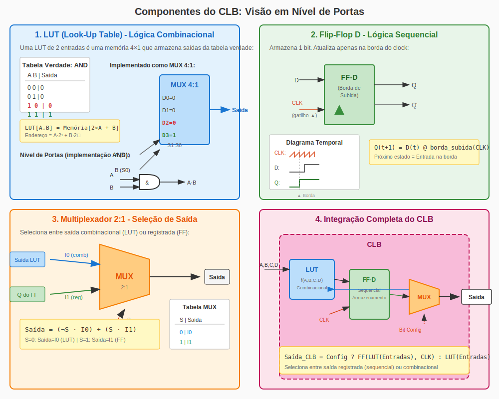

# FPGA Practical Labs

> Laboratório prático de FPGA  
> Do blink LED ao softcore RISC-V — aprenda FPGA na prática!

[](LICENSE)
[](https://wiki.sipeed.com/hardware/en/tang/Tang-Nano-9K/Nano-9K.html)
[](CONTRIBUTING.md)

[Documentação](docs/) · [Hardware](hardware/)

---

## O que é um FPGA?

Um **FPGA** (Field-Programmable Gate Array ou Matriz de Portas Programáveis em Campo) é um dispositivo semicondutor que pode ser reprogramado para implementar diversos circuitos e funções digitais. Ao contrário dos ASICs, os FPGAs oferecem flexibilidade e adaptabilidade, permitindo que os projetistas modifiquem a funcionalidade mesmo após a fabricação.

### Visão Geral da Arquitetura FPGA


Um FPGA consiste em três blocos fundamentais:

1. **CLBs (Blocos Lógicos Configuráveis)** - As unidades computacionais básicas
2. **Arquitetura de Interconexão** - Roteamento programável entre os blocos
3. **Blocos de I/O** - Interfaces para conexão com dispositivos externos

### Estrutura do Bloco Lógico Configurável (CLB)


*Figura: Estrutura interna de um Bloco Lógico Configurável*

Cada CLB contém os componentes essenciais:

- **LUT (Look-Up Table)** - Implementa funções lógicas combinacionais
- **Flip-Flop** - Armazena estado para lógica sequencial
- **Multiplexador** - Seleciona entre saída combinacional (LUT) ou registrada (Flip-Flop)

### Implementação em Nível de Portas Lógicas



*Figura: Visão detalhada em nível de portas lógicas dos componentes do CLB*

O diagrama acima mostra como cada componente funciona matematicamente:

**1. LUT (Look-Up Table)**
- Matematicamente: Uma LUT com *n* entradas implementa qualquer função Booleana de *n* variáveis
- Uma LUT 2×1 é uma memória 4×1: `Saída = Memória[2×A + B]`
- Pode implementar AND, OR, XOR ou qualquer tabela verdade

**2. Flip-Flop D**
- Modelo matemático: `Q(t+1) = D(t)` quando o clock sobe (▲)
- Armazena 1 bit de estado sincronamente
- Saída só muda na borda de subida do CLK

**3. Multiplexador 2:1**
- Equação Booleana: `Saída = (¬S · I0) + (S · I1)`
- Seleciona entre: S=0 (caminho combinacional) ou S=1 (caminho registrado)

**4. CLB Completo**
- Equação unificada: `Saída_CLB = Config ? FF(LUT(Entradas), CLK) : LUT(Entradas)`

---

## Documentação

Comece aqui se você é novo em FPGAs:

1. [O que é FPGA?](docs/01-what-is-fpga.pt.md) - Conceitos fundamentais
2. [Verilog Básico](docs/02-basic-verilog.pt.md) - Sintaxe e estrutura
3. [FPGA vs Microcontrolador](docs/03-fpga-vs-microcontroller.pt.md) - Entenda as diferenças
4. [Instalação do Gowin IDE](docs/04-gowin-ide-installation.pt.md) - Configure seu ambiente

---

## Primeiros Passos

```bash
# 1. Clone o repositório
git clone https://github.com/seuusername/fpga-practical-labs.git
cd fpga-practical-labs

# 2. Instale as ferramentas (veja docs/)

# 3. Verifique os projetos disponíveis
cd projects/

# 4. Comece com Toggle LED
cd Toggle_led/
```

## Projetos

| Projeto | Descrição | Status |
|---------|-----------|--------|
| [Toggle LED](projects/Toggle_led/) | Toggle básico de LED usando Tang Nano 9K | ✅ Disponível |
| [Servo Control](projects/servo_control/) | Controle de motor servo com LEDs de progresso | ✅ Disponível |

---

## Licença

Este projeto está licenciado sob:

- **Código**: [MIT License](LICENSE) © 2026 FPGA Practical Labs Contributors
- **Documentação**: [CC BY-SA 4.0](https://creativecommons.org/licenses/by-sa/4.0/)

---

## Apoie

Se este projeto te ajudou, considere dar uma estrela!
