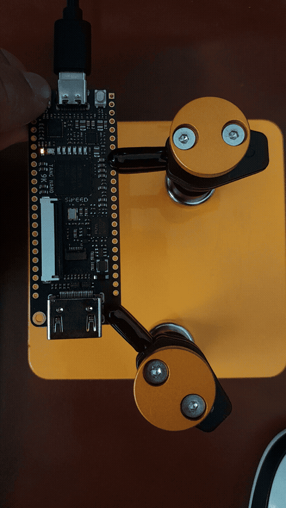

# Projects

This folder contains practical FPGA projects ranging from basic blink LED to advanced implementations like RISC-V softcore processors.

---

## Project List

| Project | Difficulty | Description |
|---------|------------|-------------|
| [Toggle LED](./Toggle_led/) | Beginner | ON/OFF control system via button with debounce and toggle |

---

## Toggle LED

**ON/OFF control system via button with debounce and toggle in FPGA**

A physical button alternates the state of 6 LEDs between on and off. Demonstrates fundamental concepts of synchronous digital design including external signal synchronization, mechanical switch debouncing, and toggle logic in Verilog.

**Key Concepts:**
- Synchronous clock design
- Mechanical switch debouncing (~5.4ms)
- Falling edge detection
- Bitwise toggle logic

**Hardware:** Tang Nano 9K (Gowin GW1NR-9C)

**Location:** [./Toggle_led/](./Toggle_led/)

---

*More projects coming soon!*
