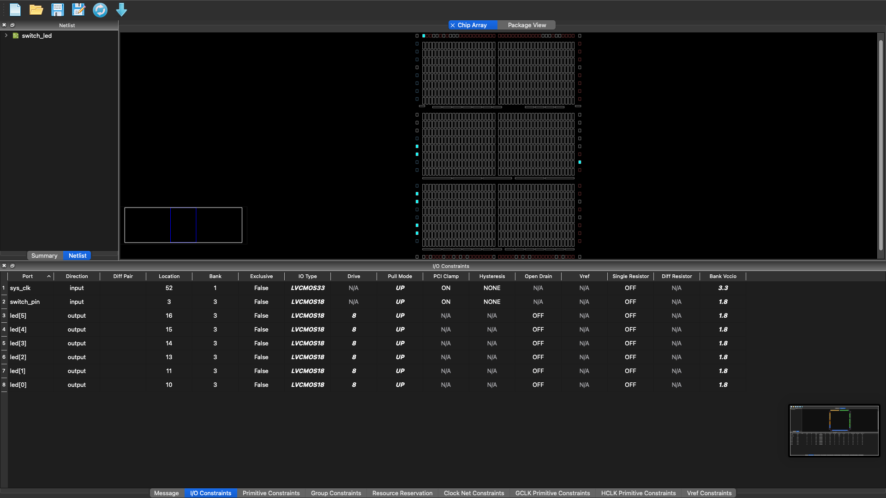
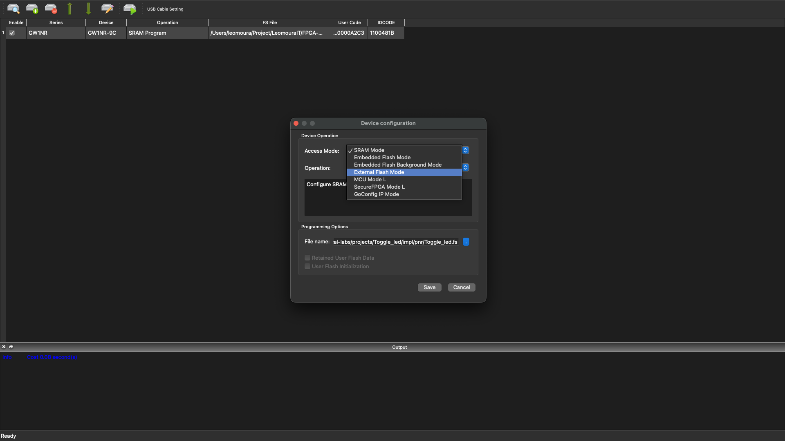

# Toggle LED - Tang Nano 9K

> ON/OFF control system via button with debounce and toggle in FPGA

## Table of Contents

- [Overview](#overview)
- [System Architecture](#system-architecture)
- [Hardware](#hardware)
- [Firmware](#firmware)
- [Detailed Operation](#detailed-operation)
- [How to Use](#how-to-use)
- [References](#references)

---

## Overview

This project implements a **toggle control system** in FPGA, where a physical button alternates the state of 6 LEDs between on and off. The solution demonstrates fundamental concepts of synchronous digital design, including external signal synchronization, mechanical switch debouncing, and toggle logic in Verilog.


*Demonstration: Button press toggles all 6 LEDs on/off*

### Learning Objectives

- Synchronization of asynchronous signals (button → system clock)
- Mechanical switch debouncing
- Toggle logic (state alternation)
- Falling edge detection
- Physical pin mapping in FPGA

---

## System Architecture

```
┌─────────────────────────────────────────────────────────────┐
│                    BLOCK DIAGRAM                            │
├─────────────────────────────────────────────────────────────┤
│                                                             │
│  ┌─────────────┐      ┌─────────────────┐      ┌─────────┐  │
│  │  BUTTON S1  │─────►│ SYNCHRONIZER    │─────►│DEBOUNCE │  │
│  │  (Pin 3)    │      │ (REGISTER)      │      │ ~5.4ms  │  │
│  │  External/  │      │                 │      │         │  │
│  │  Mechanical │      │ Stores previous │      │ Removes │  │
│  │             │      │  state          │      │ bounce  │  │
│  └─────────────┘      └─────────────────┘      └────┬────┘  │
│                                                     │       │
│                                                     ▼       │
│                                              ┌─────────┐    │
│                                              │  TOGGLE │    │
│                                              │  LOGIC  │    │
│                                              │         │    │
│                                              │ Inverts │    │
│                                              │ state   │    │
│                                              │ LEDs    │    │
│                                              └────┬────┘    │
│                                                   │         │
│                                                   ▼         │
│                                            ┌─────────────┐  │
│                                            │  6 LEDs     │  │
│                                            │  (Pins      │  │
│                                            │   10-16)    │  │
│                                            └─────────────┘  │
│                                                             │
│  CLOCK: 50 MHz (assumed in code)                            │
│         27 MHz (actual Tang Nano 9K)                        │
│                                                             │
└─────────────────────────────────────────────────────────────┘
```

---

## Hardware

### Board Specifications

| Component | Specification |
|-----------|---------------|
| FPGA | Gowin GW1NR-9C |
| LUTs | 8,640 |
| Clock | 27 MHz (onboard crystal) - *See note below* |
| LEDs | 6x LED (active high) |
| Buttons | 2x tactile buttons (S1, S2) |

> **Clock Note:** The code was designed assuming a **50 MHz** clock, where 270,000 cycles result in ~5.4ms debounce. On the Tang Nano 9K, the actual clock is **27 MHz**, resulting in an actual debounce time of ~10ms (270,000 ÷ 27,000,000).

### Pin Mapping

| Signal | FPGA Pin | Function | Direction | I/O Standard |
|--------|----------|----------|-----------|--------------|
| `sys_clk` | 52 | System clock | Input | LVCMOS33 |
| `switch_pin` | 3 | Button S1 | Input | LVCMOS18 |
| `led[0]` | 10 | LED 0 | Output | LVCMOS18 |
| `led[1]` | 11 | LED 1 | Output | LVCMOS18 |
| `led[2]` | 13 | LED 2 | Output | LVCMOS18 |
| `led[3]` | 14 | LED 3 | Output | LVCMOS18 |
| `led[4]` | 15 | LED 4 | Output | LVCMOS18 |
| `led[5]` | 16 | LED 5 | Output | LVCMOS18 |

### Electrical Characteristics

**Button S1 (Pin 3):**
```
├── Internal pull-up active (PULL_MODE=UP)
├── High logic level (1) when released: 1.8V (via pull-up)
├── Low logic level (0) when pressed: 0V (GND)
├── IO_TYPE=LVCMOS18 (1.8V)
└── Debounce required: ~5-20ms (mechanical)
```

**LEDs (Pins 10-16):**
```
├── Active at high level (1 = on, 0 = off)
├── Current: 8mA per LED (DRIVE=8)
├── Voltage: 1.8V (BANK_VCCIO=1.8)
└── Active pull-up for defined state
```

**Clock (Pin 52):**
```
├── External clock from onboard oscillator
├── IO_TYPE=LVCMOS33 (3.3V)
├── Frequency: 27 MHz (Tang Nano 9K)
└── Active pull-up
```

---

## Firmware

### Code Structure

The firmware is implemented in **Verilog HDL** and consists of a single synchronous module.


*Creating a new Verilog file in Gowin IDE*

#### 1. Module Interface

```verilog
module switch_led (
    input sys_clk,          // System clock (assumed 50MHz in code)
    input switch_pin,       // Button S1 input (active low)
    output reg [5:0] led    // Output to 6 LEDs
);
```

| Port | Direction | Width | Description |
|------|-----------|-------|-------------|
| `sys_clk` | Input | 1 bit | Main clock (27 MHz on board, 50MHz in calculation) |
| `switch_pin` | Input | 1 bit | Button signal (active low, with pull-up) |
| `led` | Output | 6 bits | LED control vector |

#### 2. Internal Registers

```verilog
reg switch_prev;            // Previous button state (for edge detection)
reg [19:0] debounce_cnt;    // Debounce counter (20 bits)
```

| Register | Width | Function |
|----------|-------|----------|
| `switch_prev` | 1 bit | Stores previous button state for falling edge detection |
| `debounce_cnt` | 20 bits | Counter for debounce delay. Counts up to 270,000 cycles |

**Why 20 bits?**
- The counter needs to store values up to 270,000
- 2^18 = 262,144 (insufficient)
- 2^19 = 524,288 (sufficient)
- 2^20 = 1,048,576 (used, with margin)

#### 3. Initialization

```verilog
initial begin
    led = 6'b000000;        // LEDs start off (all 0)
    switch_prev = 1'b1;     // Button released (internal pull-up keeps it at 1)
    debounce_cnt = 20'd0;   // Counter cleared
end
```

The `initial` block defines the power-up state of the system. In FPGAs, this block configures the initial value of flip-flops after programming.

#### 4. Main Logic

```verilog
always @(posedge sys_clk) begin
    // Debounce: wait 270,000 cycles between samples
    if (debounce_cnt < 20'd270000) begin
        debounce_cnt <= debounce_cnt + 1'b1;
    end else begin
        debounce_cnt <= 20'd0;
        
        // Update previous button state
        switch_prev <= switch_pin;
        
        // Detect falling edge (1 → 0): button was pressed
        if (switch_prev && !switch_pin) begin
            led <= ~led;    // Invert all bits (toggle)
        end
    end
end
```

---

## Detailed Operation

### Temporal State Machine

```
TIME ───────────────────────────────────────────────────────►

sys_clk:    ‾‾‾‾‾‾‾‾‾‾‾‾‾‾‾‾‾‾‾‾‾‾‾‾‾‾‾‾‾‾‾‾‾‾‾‾‾‾‾‾‾‾‾‾‾‾‾‾‾‾
            ____/‾‾‾‾\____/‾‾‾‾\____/‾‾‾‾\____/‾‾‾‾\____/‾‾‾‾
            ↑    ↑    ↑    ↑
         posedge posedge posedge posedge ... (execution points)

Button S1:  ‾‾‾‾‾‾‾‾‾‾‾‾‾‾‾‾‾‾‾‾‾‾‾‾‾‾‾‾‾‾‾‾‾‾‾‾‾‾‾‾‾‾‾‾‾‾‾‾‾‾
            __________\_________/‾‾‾‾‾‾‾‾‾‾‾‾‾‾‾‾‾‾‾‾‾‾‾‾‾‾‾‾‾
                       ↑         ↑
                    press     release
                    (bounce)   (stable)

debounce_cnt: 0 → 270000 → 0 → 270000 → 0 → ...
                    ↑              ↑
                 (waits        (executes!
                  ~5.4ms)        toggle)

LEDs:       ░░░░░░░░░░░░░░░░░░░░░░████████████░░░░░░░░░░░░░░░
            (off)                 (on)          (off...)
                                    ↑
                                  toggle
                                  (bit inversion)
```

### Debounce Analysis

**Why is it needed?**
Mechanical switches exhibit "bounce" (chatter) when actuated:

```
Ideal signal:    ‾‾‾‾‾‾‾‾‾‾‾‾‾‾‾‾‾‾‾‾‾‾‾‾‾‾‾‾‾‾‾‾‾‾‾‾‾‾‾‾‾‾‾‾‾
                 ___________/‾‾‾‾‾‾‾‾‾‾‾‾‾‾‾‾‾‾‾‾‾‾‾‾‾‾‾‾‾‾‾‾

Real signal:     ‾‾‾‾‾‾‾‾‾‾‾‾‾‾‾‾‾‾‾‾‾‾‾‾‾‾‾‾‾‾‾‾‾‾‾‾‾‾‾‾‾‾‾‾‾
                 ___________/\____/\__/‾‾‾‾‾‾‾‾‾‾‾‾‾‾‾‾‾‾‾‾‾‾
                              ↑  ↑  ↑
                           bounce (noise)
                           lasts ~5-20ms

Without debounce:  FPGA sees multiple presses → erratic toggle
With debounce:     FPGA sees 1 clean press → correct toggle
```

**Debounce period calculation:**

The code assumes 50 MHz clock for the calculation:

```
Clock frequency (assumed): 50 MHz
Clock period: 1 / 50,000,000 = 20 nanoseconds

Desired debounce period: 5.4 ms
Required count: 5.4ms / 20ns = 270,000 cycles
```

**On Tang Nano 9K (actual 27 MHz clock):**

```
Clock frequency (actual): 27 MHz
Clock period: 1 / 27,000,000 ≈ 37 nanoseconds

Actual debounce period: 270,000 × 37ns ≈ 10 ms
```

### Chip Array and Physical Layout

The **Floor Planner** shows two important visualizations of how your Verilog code is implemented physically in the FPGA silicon:

#### Chip Array (Matrix of Logic Blocks)

The physical FPGA is organized as a **two-dimensional matrix** of configurable logic blocks (CLBs):

```
┌─────────────────────────────────────────────────────────────┐
│                    GW1NR-9 CHIP ARRAY                       │
├─────────────────────────────────────────────────────────────┤
│                                                             │
│  ┌─────┐ ┌─────┐ ┌─────┐ ┌─────┐         ┌─────┐ ┌─────┐   │
│  │ CLB │ │ CLB │ │ CLB │ │ CLB │   ...   │ CLB │ │ I/O │ ← Pins 10-16
│  │(0,0)│ │(0,1)│ │(0,2)│ │(0,3)│         │     │ │LEDs │   │
│  └──┬──┘ └──┬──┘ └──┬──┘ └──┬──┘         └──┬──┘ └──┬──┘   │
│     │       │       │       │               │       │       │
│  ┌──┴──┐ ┌──┴──┐ ┌──┴──┐ ┌──┴──┐         ┌──┴──┐ ┌──┴──┐   │
│  │ CLB │ │ CLB │ │ FF  │ │ FF  │   ...   │ FF  │ │ I/O │   │
│  │     │ │     │ │cnt0 │ │cnt1 │         │cnt19│ │ S1  │ ← Pin 3
│  └──┬──┘ └──┬──┘ └──┬──┘ └──┬──┘         └──┬──┘ └──┬──┘   │
│     │       │       │       │               │       │       │
│  ┌──┴──┐ ┌──┴──┐ ┌──┴──┐ ┌──┴──┐         ┌──┴──┐ ┌──┴──┐   │
│  │ CLB │ │ CLB │ │ FF  │ │ FF  │   ...   │ FF  │ │ I/O │   │
│  │     │ │     │ │led0 │ │led1 │         │led5 │ │ CLK │ ← Pin 52
│  └─────┘ └─────┘ └─────┘ └─────┘         └─────┘ └─────┘   │
│                                                             │
│       ... (matrix continues across entire chip area) ...    │
│                                                             │
│  ┌─────────────────────────────────────────────────────┐    │
│  │           INTERCONNECTION MATRIX                    │    │
│  │  (Programmable wires connecting CLBs to each other) │    │
│  └─────────────────────────────────────────────────────┘    │
│                                                             │
└─────────────────────────────────────────────────────────────┘
```

**Array Components:**

| Element | Abbreviation | Function |
|---------|--------------|----------|
| **Configurable Logic Block** | CLB | Basic programmable logic unit. Contains LUTs and Flip-Flops |
| **Look-Up Table** | LUT | Implements combinational logic functions (AND, OR, XOR, etc.) |
| **Flip-Flop** | FF | Stores 1 bit of state (registers like `led`, `debounce_cnt`) |
| **I/O Block** | IOB | Interface between FPGA core and external physical pins |
| **Interconnection Matrix** | - | Network of programmable wires routing signals between CLBs |

#### From Code to Silicon

The compilation process transforms your code into physical elements:

```
┌──────────────────────────────────────────────────────────────────┐
│  STAGE 1: Verilog Code (Abstract)                                │
├──────────────────────────────────────────────────────────────────┤
│  reg [5:0] led;           ← Vector of 6 registers                │
│  reg [19:0] debounce_cnt; ← 20-bit counter                       │
│  always @(posedge sys_clk) ...                                   │
│      led <= ~led;         ← Bit-by-bit inversion                 │
└──────────────────────────────────────────────────────────────────┘
                            ↓ SYNTHESIS
                            
┌──────────────────────────────────────────────────────────────────┐
│  STAGE 2: Netlist (Component List)                               │
├──────────────────────────────────────────────────────────────────┤
│  • 27 Flip-Flops (6 for led + 20 for counter + 1 for prev)      │
│  • 6 Inverters (NOT bit-by-bit for led <= ~led)                  │
│  • 1 20-bit Comparator (debounce_cnt < 270000)                   │
│  • 1 20-bit Adder (debounce_cnt + 1)                             │
│  • AND logic gates (edge detection)                              │
└──────────────────────────────────────────────────────────────────┘
                            ↓ PLACE & ROUTE
                            
┌──────────────────────────────────────────────────────────────────┐
│  STAGE 3: Physical Layout (Array Allocation)                     │
├──────────────────────────────────────────────────────────────────┤
│  • FF led[0] → CLB(2,3)  ──Route──→ IOB → Pin 10 (LED0)         │
│  • FF led[1] → CLB(2,4)  ──Route──→ IOB → Pin 11 (LED1)         │
│  • FF led[5] → CLB(3,5)  ──Route──→ IOB → Pin 16 (LED5)         │
│  • FF cnt[0:19] → CLBs(4,1) to (4,5) (grouped counter)          │
│  • Input S1 → IOB(Pin 3) ──Route──→ CLB(5,1)                    │
│  • Clock → IOB(Pin 52) ──Route──→ Global clock matrix           │
└──────────────────────────────────────────────────────────────────┘
```

#### Floor Planner Visualization

The images show:

**Netlist Chip Array:**
- Each **dot** represents a physical element occupying a position in the matrix
- **Blue dots**: Flip-flops (registers that store state)
- **Red/yellow dots**: LUTs (combinational logic)
- **Lines**: Physical connections (routes) between blocks

**Netlist Package:**
- Shows the physical view of the packaged chip (QN88 - 88 pins)
- Indicates where physical pins are located (Pin 3, 10, 11, etc.)
- Shows the relationship between logical pins in your code and physical chip pins

#### Why This Matters

| Aspect | Description |
|--------|-------------|
| **Resource Utilization** | Visualizes which areas of the FPGA are being used |
| **Timing** | Shorter connections (nearby blocks) = lower propagation delay |
| **Physical Constraints** | The `.cst` file defines "Pin 3 = switch_pin", and the Floor Planner shows where this is physically located |
| **Debug** | Allows verification that components are being positioned efficiently |

#### Analogy: FPGA as an Office Building

| FPGA | Office Building |
|------|-----------------|
| **Chip Array** | The entire building with its floors and hallways |
| **CLB** | An individual office room |
| **I/O Block** | The ground floor reception (connects to the outside world) |
| **Floor Plan** | The blueprint showing who occupies which room |
| **Place & Route** | The architect deciding where each department goes and how hallways connect the rooms |
| **Netlist** | The list of employees and who they need to communicate with |

In your Toggle LED project:
- The **counter department** (20 flip-flops) occupies several adjacent rooms
- The **LEDs department** (6 flip-flops) stays near the exits (pins 10-16)
- The **button department** stays near the entrance (pin 3)
- The **hallways** (interconnection wires) carry signals between departments

### Falling Edge Detection

The condition `if (switch_prev && !switch_pin)` detects the falling edge:

**Transition Table:**

| Previous State (`switch_prev`) | Current State (`switch_pin`) | `!switch_pin` | Condition | Event |
|-------------------------------|-----------------------------|---------------|-----------|--------|
| 1 | 1 | 0 | 1 && 0 = 0 | No change (high) |
| 1 | 0 | 1 | 1 && 1 = 1 | **FALLING EDGE** |
| 0 | 1 | 0 | 0 && 0 = 0 | Rising edge |
| 0 | 0 | 1 | 0 && 1 = 0 | No change (low) |

**Operator explanation:**
- `&&` : Logical AND operator - returns 1 only if both operands are 1
- `!`  : Logical NOT operator - inverts the value (0→1, 1→0)

The falling edge (row 2) occurs when the button is pressed (transition from 1 to 0).

### Toggle Logic

The operation `led <= ~led` performs bit-by-bit inversion of the vector:

| Current State | Operation | Next State |
|---------------|-----------|------------|
| `000000` (0x00) | `~000000` | `111111` (0x3F) |
| `111111` (0x3F) | `~111111` | `000000` (0x00) |

**Difference between `~` and `!` in Verilog:**
- `~` : Bitwise NOT - inverts each bit individually (`~6'b001011 = 6'b110100`)
- `!` : Logical NOT - returns 1 bit: 1 if the value is 0, 0 otherwise (`!6'b001011 = 1'b0`)

---

## How to Use

### Compilation and Programming

#### Development Flow


*Accessing the Floor Planner to visualize the physical layout*


*Netlist visualization on the chip array*


*Netlist visualization on the FPGA package*

#### Steps

1. Open project in Gowin IDE
2. Verify that `toggle_led.v` and `Toggle_led.cst` files are included
3. Synthesize (Ctrl+S or green button)
4. Place & Route (Ctrl+R)


*Place & Route result showing connection routing*

5. Program Device (Ctrl+P or download button)


*Selecting the FPGA device for programming*


*Device detected and ready for programming*

##### Programming Modes

**SRAM Mode** (for quick testing):
- Bitstream is loaded into FPGA SRAM memory
- Lost when power is removed
- Useful for development and debugging


*Programming in SRAM mode*

**External Flash Mode** (for permanent use):
- Bitstream is written to external flash memory
- Persists after power-off
- FPGA loads automatically on power-up


*Programming to external flash memory*

##### Troubleshooting


*Error message when cable is not detected - check USB connection*

### Operation

| Action | Result |
|--------|--------|
| Connect USB | Power LED lights up (indicates power) |
| 1st press of S1 | All 6 LEDs turn on |
| 2nd press of S1 | All 6 LEDs turn off |
| Hold S1 pressed | No effect (waits for release before next cycle) |

---

## References

### Technical Documentation

- [Tang Nano 9K Wiki](https://wiki.sipeed.com/hardware/en/tang/Tang-Nano-9K/Nano-9K.html)

### Related Concepts

| Concept | Description |
|---------|-------------|
| **Debounce** | Technique to eliminate noise from mechanical switches |
| **Falling edge** | Signal transition from high (1) to low (0) |
| **Toggle** | State alternation (ON ↔ OFF) |
| **Synchronous clock** | System where operations occur at clock edges |

---

## Resource Consumption

| Resource | Used | Available | Percentage |
|----------|------|-----------|------------|
| LUTs | ~12 | 8,640 | ~0.14% |
| FFs | 22 | 6,480 | ~0.34% |
| BSRAM | 0 | 26 | 0% |
| PLL | 0 | 2 | 0% |

---

**License:** MIT © 2026 FPGA Practical Labs Contributors
